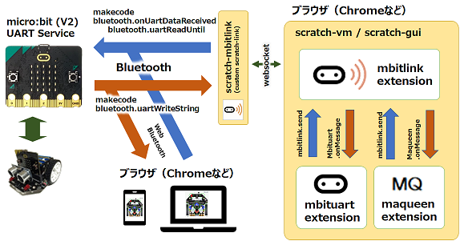
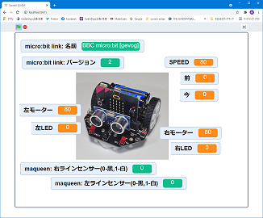

作ったもの（リポジトリ）

## Scratch3からmicro:bit+maqueenを操作

<video src="https://marron9999.github.io/scratch-maqueen.mp4" style="width:640px;height:360px;"></video>

- [sc3](https://github.com/marron9999/sc3/) : Scratch3本体(vm、gui)の変更箇所
- [sc3-mbitlink](https://github.com/marron9999/sc3-mbitlink/) : Scratch3とmicro:bit間の通信 (BLE UART)
- [sc3-mbituart](https://github.com/marron9999/sc3-mbituart/) : micro:bit向けGUI (ブロック等)
- [sc3-maqueen](https://github.com/marron9999/sc3-maqueen/) : maqueen向けGUI (ブロック等)

## ブラウザ(chrome)からmicro:bit+maqueenを操作

- [maqueen](https://github.com/marron9999/maqueen/) : Web Bluetooth（HTML+JavaScript)部分

## micro:bit+maqueenをリモート操作

- [mbitlink_hex](https://github.com/marron9999/mbitlink_hex/) : micro:bitに入れるプログラム

- micro:bit v2向け makecode拡張機能

	- [lib-mbitlink](https://github.com/marron9999/lib-mbitlink/) : micro:bit通信処理
	- [lib-mbituart](https://github.com/marron9999/lib-mbituart/) : micro:bitセンサー処理
	- [lib-maqueen](https://github.com/marron9999/lib-maqueen/) : maqueen処理

## micro:bitからmicro:bit+maqueenを操作

- [maqueen_p2p](https://github.com/marron9999/maqueen_p2p/) : micro:bitに入れるプログラム

